# FORO MERAKI

_Diseño de un foro técnico mediante PHP para tratar temas de tecnología, informática, literatura, arte, ..._

_Además de la vista normal del foro se encuentra la vista de administrador, a la cual sólo se podrá acceder con las 
cuentas de administrador. Más adelante explico el proceso._

## Modelo entidad relación 🔛

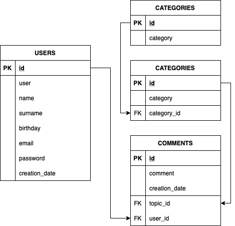

## Explicación de clases 🗂

_Como se puede ver en la imagen el foro está compuesto por 4 clases._

_Primero están las categorías, género al que pertenece cada tema (ej: Informática)._

_Los temas son los subgéneros (ej: categoría: Informática -> tema: Vulnerabilidad log4j)._

_A continuación están los comentarios, los cuales pertenecen tanto a un tema como a un usuario. También se guarda la
fecha de creación de los mismo que se coge la fecha actual por defecto._

## Comenzando 🚀

_Estas instrucciones te permitirán obtener una copia del proyecto en funcionamiento en tu máquina local para propósitos
de desarrollo y pruebas._

### Pre-requisitos 📋

_Cosas que necesitas para instalar el software y como instalarlas_

```
- Programa que permita editar y crear código HTML, CSS, y PHP (ej: PHPStorm)
- Programa de gestión de bases de datos mySQL (ej: XAMPP)
```

### Instalación 🔧

_Una serie de ejemplos paso a paso que te dice lo que debes ejecutar para tener un entorno de desarrollo ejecutandose_

```
- Clonar el este repositorio y situarse en la rama FINAL
- Importar el archivo SQL de la página princiapl (forum.sql) al interfaz de mySQL
```

## Despliegue 📦

_Acceso a la vista general del foro:_

* Inicia la base de datos
* Ejecuta el archivo init.php situado en la carpeta general
* Navega por las diferentes vistas generales del foro

_Acceso a la vista de administrador:_

* Con la base de datos iniciada ejecuta el archivo init.php situado en la carpeta admin
* Para un acceso general de administrador inicie sesión con la cuenta: admin, contraseña: admin
* Para acceder solo a la gestión de comentarios inicie sesión con la cuenta: comments_admin, contraseña: comments_admin

## Navegación y funcionalidad de las vistas 💻

### Vista general 

_Al ejecutar el archivo init.php de la carpeta general, si es la primera vez que lo ejecutas redirige a la página principal
del foro, donde encontrarás los comentarios filtrados por temas. Si ya has iniciado una sesión, redirigirá a la página principal 
también, pero con la sesión iniciada, por lo que podrás comentar directamente._

#### Página principal

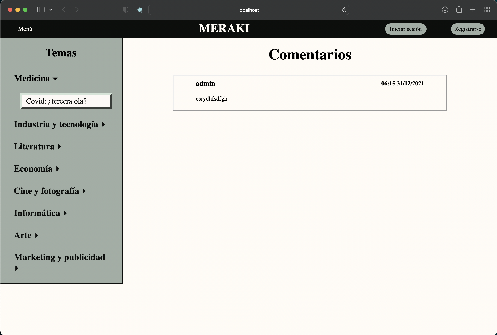

_En el encabezado encontramos a la izquierda el menú. Al hacer click aparece un menú desplegable con las diferentes
páginas a las que podemos acceder. Si la sesión no está iniciada solo se puede navegar entre la página principal, 
categorías, temas e inicio de sesión y registro. Mientras que si ya se ha iniciado sesión la opción de inicio de sesión 
y registro cambia por las páginas de Tus comentarios, panel de usuario y cierre de sesión._

_En el encabezado a la izquierda están las opciones de inicio de sesión y registro, las cuales desaparecen al iniciar sesión
o registrarse._

_En el menú lateral de la izquierda se muestran todas las categorías y por defecto se muestra desplegada la primera 
categoría, mostrando así los temas que contiene y apareciendo seleccionado el primero por defecto._
_Al hacer click en las diferentes categorías se despliegan los temas asociados a cada una, pudiendo seleccionar cualquiera 
de ellos. Al seleccionar otro tema aparecen en la sección de comentarios los comentarios asociados a ese tema, ordenados 
de más viejo a más nuevo. En los comentarios aparece arriba a la izquierda el nombre de usuario del que lo realizó y, a la 
derecha, la hora y la fecha a la que se realizó._

#### Página principal al iniciar sesión


_Al iniciar sesión o registrarse aparece la cajetilla para añadir comentarios. Además, puedes eliminar los comentarios
que has dejado haciendo click en la papelera. La papelera sólo aparece en los comentarios que ha realizado el usuario que
haya iniciado sesión. Al hacer click en la papelera aparece un mensaje de confirmación para asegurarse de que quieres eliminarlo._

#### Página de inicio de sesión

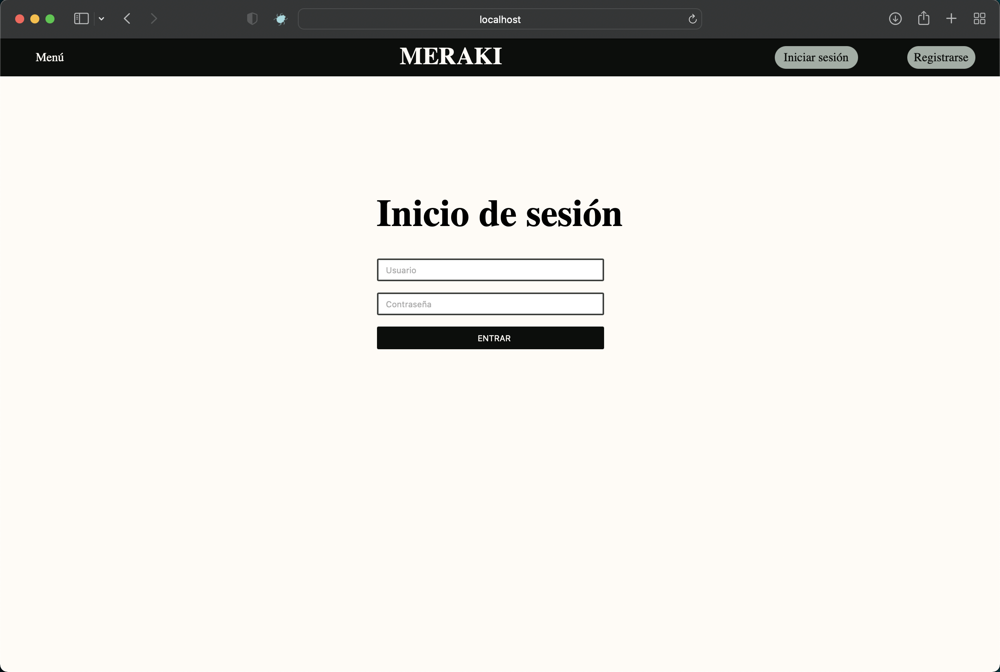

_La página de inicio de sesión es muy simple, hay que introducir usuario y contraseña. Para verificar que el usuario existe
y la contraseña es la correcta, aademás de otras cosas, se realiza una validación del formulario._

#### Página de registro

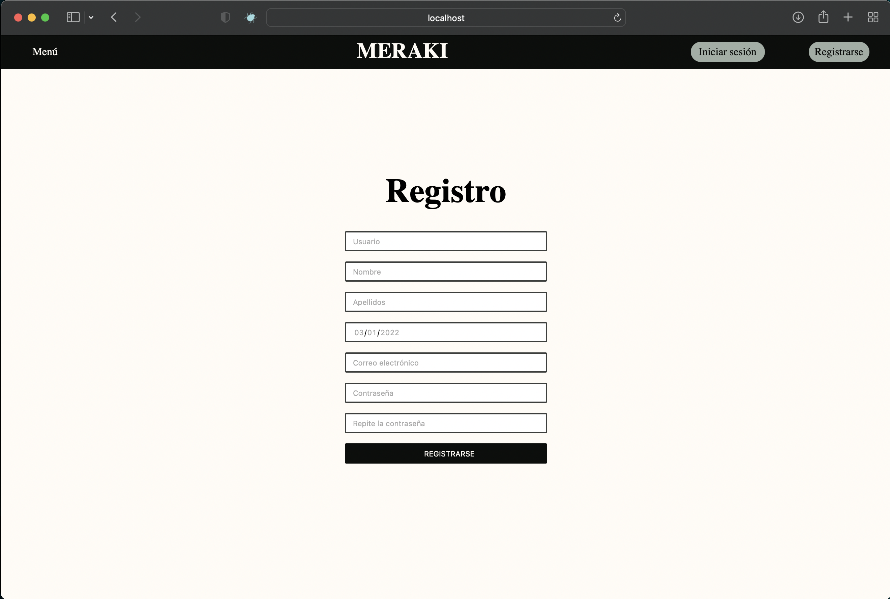

_La página de registro es un formulario en el que introducir los diferentes campos que se guardarán en la base de datos.
Como en el login, se valida que todos los campos del formulario estén rellenados correctamente. Una vez se registra el usuario
se envia un correo a la cuenta de correo electrónico que ha introducido._

#### Página de categorías

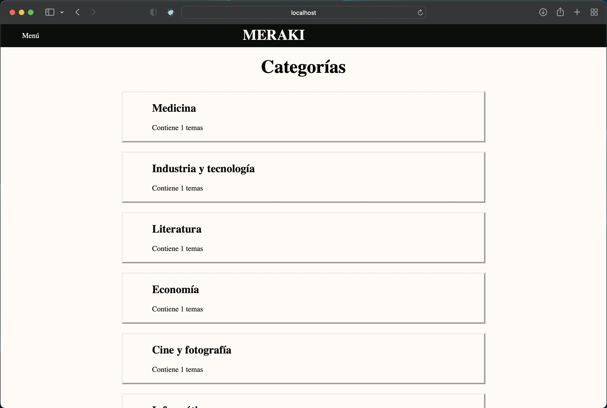

_Se muestra un listado de todas las categorías e indica los temas que contiene cada una. Se puede hacer click en ellas, 
y al hacerlo redirige a la página de temas._

#### Página de temas

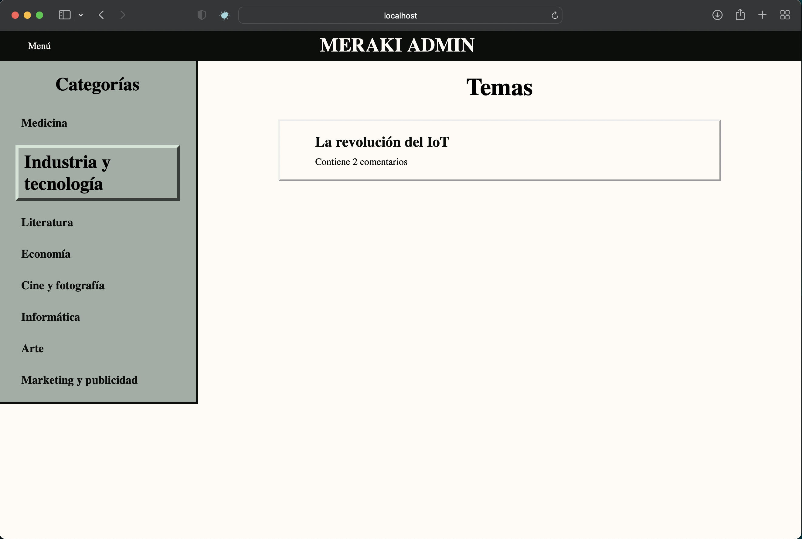

_Si vienes a esta página redirigido de categorías, la categoría que aparecerá señalada en el menú lateral izquierdo es
a la que has hecho click. A la derecha se muestran los temas asociados a la categoría seleccionada. Al seleccionar otra
apareceran sus temas. Al hacer click en un tema redirige a la página principal con la categoría y el tema seleccionados 
en base al tema al que le hayas hecho click._

#### Página Tus comentarios

_Esta página es igual que la página principal solo que en el menú de la izquierda solo aparecen las categorías y los temas
en los que hayas comentado. Y en el apartado de comentarios solo aparecen los comentarios que haya realizado ese usuario._

#### Página de panel de usuario


_En esta página aparecen los datos del usuario, pudiendo modificarlos o modificar la contraseña. Al querer modificar 
los datos de usuario aparece un formulario como el de registro, solo que los inputs ya tienen rellenos los datos. Se pueden
modificar los que se quiera y los otros dejarlos como están. Si se cambian el usuario o la contraseña se actualizan los
esos campos de la sesión automáticamente._

### Vista de administrador 👩🏻‍💻

#### Página de inicio de sesión

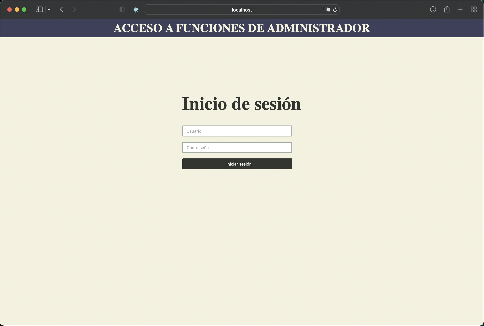

_Nada más ejecutar el archivo init.php de la carpeta admin te redirige a la pantalla de login. En caso de que tengas 
una sesión iniciada con el usuario admin en redirige a la pantalla principal, mientras que si la sesión está iniciada con
el usuario comments_admin redirige a la pantalla de comentarios. Si la sesión está iniciada con cualquier otra cuenta de 
usuario, esa sesión se destruye y redirige a la página de inicio de sesión._

_Para iniciar sesión hay que rellenar el formulario que se valida mediane el archivo validate.php. Solo pueden iniciar
sesión los usuarios admin o comments_admin con sus respectivas contraseñas. Si se inicia sesión con la cuenta de admin se
redirige a la página principal, mientras que si se hace con la cuenta comments_admin redirige a la pantalla de comentarios._

#### Página principal

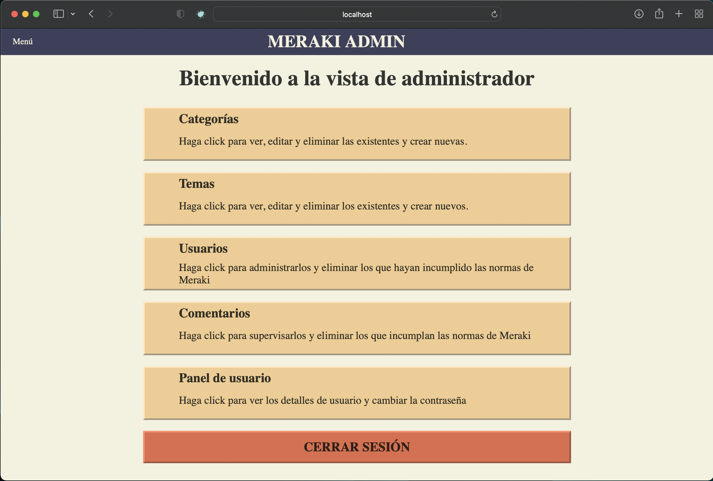

_En el encabezado se sitúa el menú desplegable. Si la sesión se ha iniciado con la cuenta admin puede navegar por todas
las páginas, mientras que si se inicia con comments_admin solo puede navegar por la página de comentnarios y la de panel
de usuario._

_En la página principal se muestran todas las páginas con una breve descripción de lo que se puede hacer en cada una. 
Al hacer click en una de ellas redirige a la página correspondiente._

#### Página de categorías

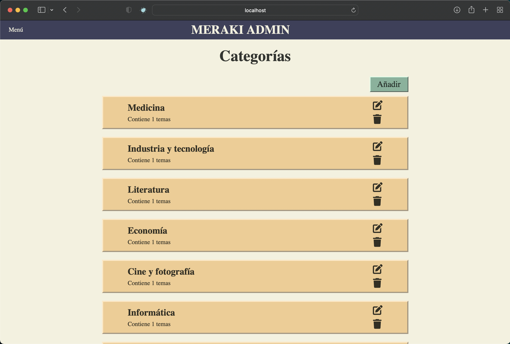

_Muestra un listado de todas las categorías pudiendolas editar o eliminar individualmente y añadir nuevas._

_Al hacer click en el icono de editar aparece un formulario para introducir el nuevo nombre de la categoría, mostrando por
defecto el nombre actual._

_Al hacer click en eliminar aparece un mensaje de confirmación, ya que al eliminar una categoría se eliminan tanto los temas
como los comentarios asociados a ella._

#### Página de temas

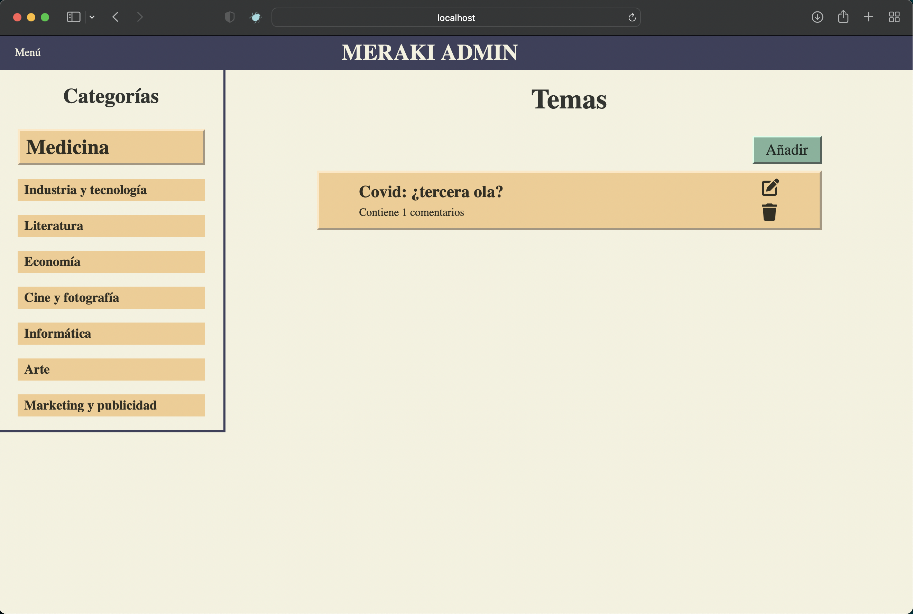

_Como sucede en la página de categorías se pueden eliminar o editar individualmente, o añadir nuevos._

_En el menú de la izquierda muestra la categoría que está seleccionada y a la derecha los temas asociados a ella. Si se 
selecciona otra categoría, los temas cambian._

_Al añadir un nuevo tema aparece un formulario para introducir el nombre del tema y debajo un desplegable en el que seleccionar
la categoría. Por defecto viene seleccionada la categoría que tienes seleccionada en el menú de la izquierda, al guardar el tema
en otra categoría se selecciona automáticamente esa categoría en el menú de la izquierda para ver el tema que se ha creado._

#### Página de usuarios

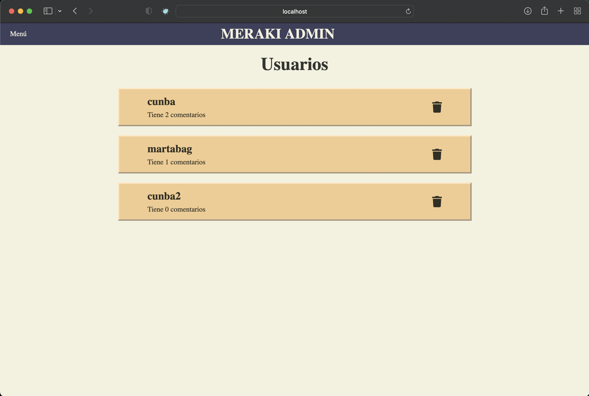

_En este caso solo se pueden eliminar los usuarios, por motivos de privacidad de la cuenta. Además de poner el nombre de 
usuario pone la cantidad de comentarios asociados a su cuenta. Si se elimina un usuario se eliminan también los comentarios
asociados._

_Por motivos de seguridad solo aparecen los usuarios que no tengan que ver con cuentas de administración._

#### Página de comentarios

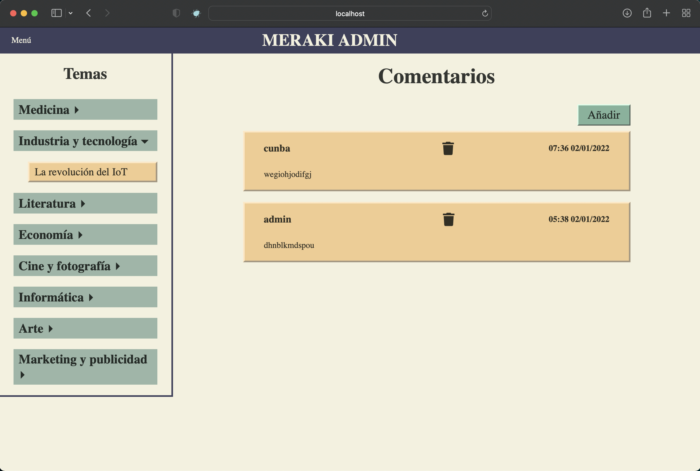

_Al igual que en la página principal del foro, tenemos el menú de la izquierda y los comentarios asociados al tema seleccionado
en la derecha. En este caso solo se pueden eliminar y crear nuevos. Los comentarios que se creen nuevos irán siempre
asociados a la cuenta de admin._

_Tanto admin como comments_admin pueden administrar los comentarios, mientras que comments_admin no puede administrar el 
resto de cosas._

#### Página de usuario

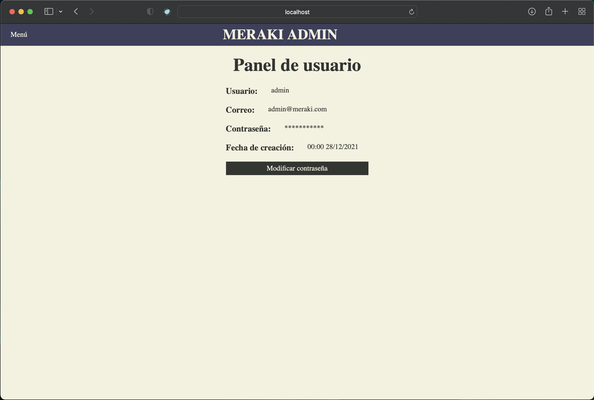

_En este caso solo se muestra el usuario, el correo y la fecha de creación. Por motivos de seguridad, sólo se puede cambiar
la contraseña, aunque no es muy recomendable._

## Construido con 🛠️

* [PHPStorm](https://www.jetbrains.com/es-es/idea/) - Framework web usado
* [XAMPP](https://www.apachefriends.org/es/index.html) - Gestor de bases de datos

## Autores ✒️

* **Irene Cunto** - *Trabajo Principal y documentación* - [cunba](https://github.com/cunba)
---
⌨️ con ❤️ por [cunba](https://github.com/cunba) 😊